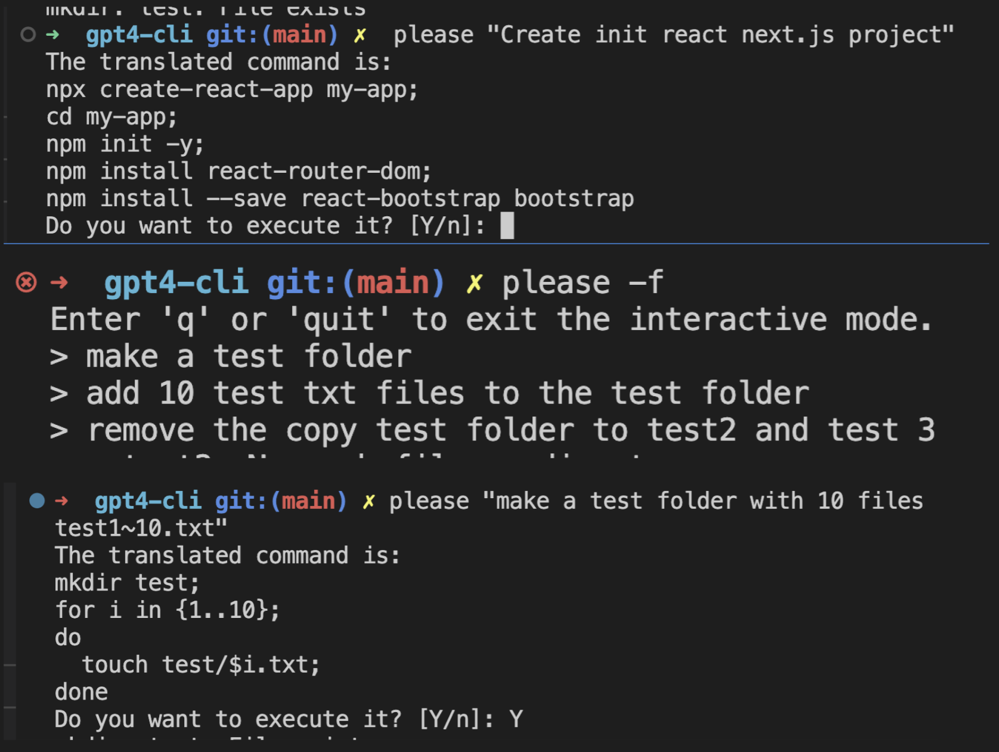

# GPT-4 Command Line Interface



A simple command line tool for interacting with GPT-4 using natural language.

## Installation

1. Install Python and necessary dependencies:

```bash
pip install openai argparse python-dotenv
```

2. Set up your .env file with your GPT-4 API key:
```
OPENAI_API_KEY=<your_api_key_here>
```

3. Run the install.sh script to automatically set up the command aliases:
```
./install.sh
```

4. Restart your terminal or run 'source ~/.bashrc' (or the respective shell configuration file) to apply the changes.

## Usage
To use the command line tool, type please or pls (case-insensitive) followed by your natural language command:

```
please "create a new folder named test_folder"
```
or

```
Pls "create a new folder named test_folder"
```

By default, the tool will ask for your confirmation before executing the translated command. If you want to force the execution without asking for confirmation, use the -f or --force option:
 
```
Pls --force "create a new folder named test_folder"
```
# gpt4-cli
